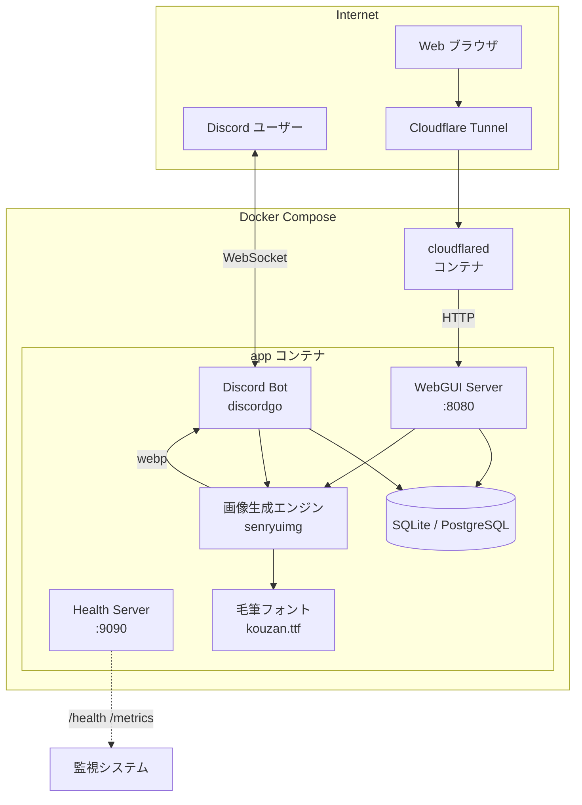
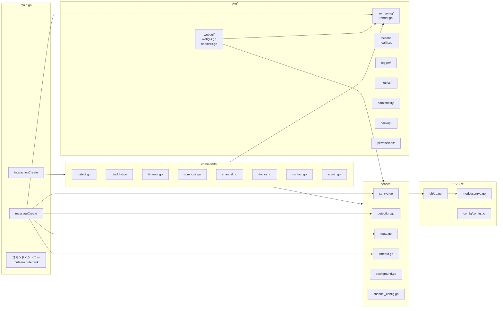
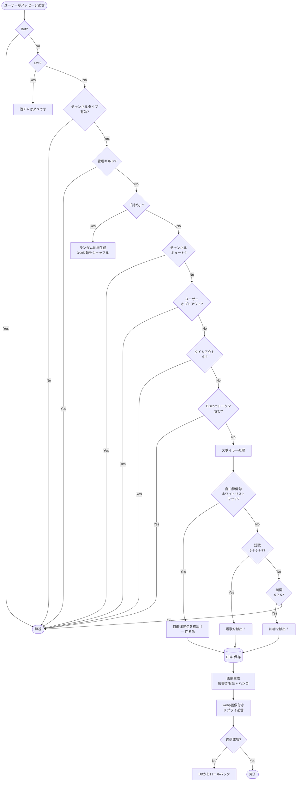
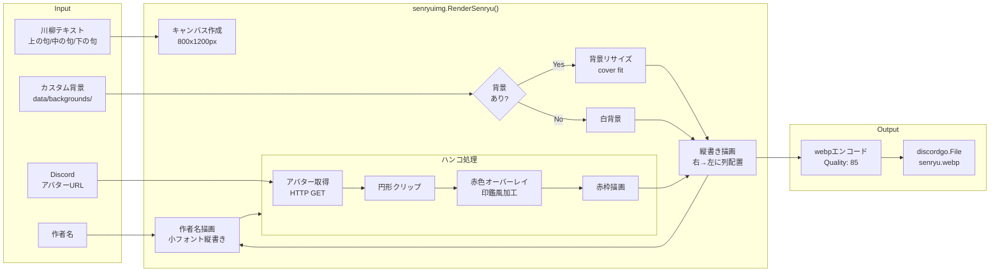
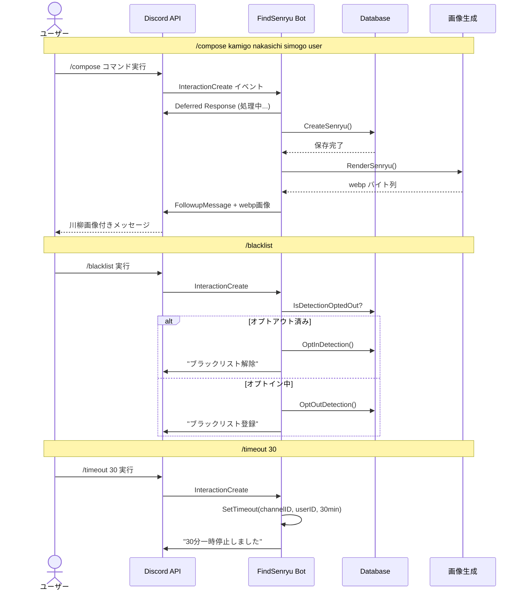
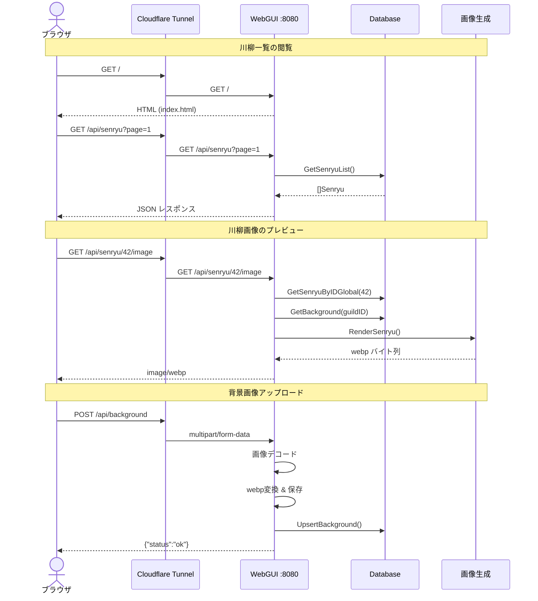
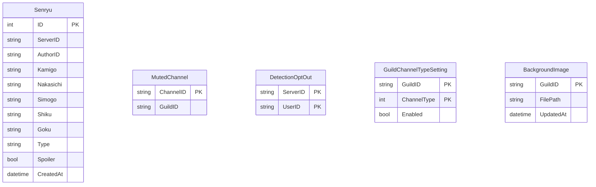
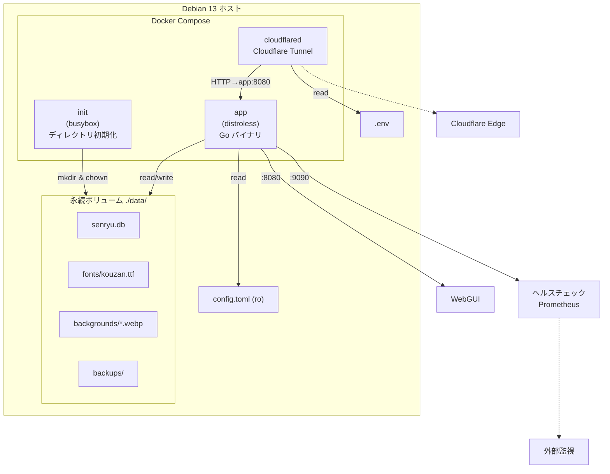
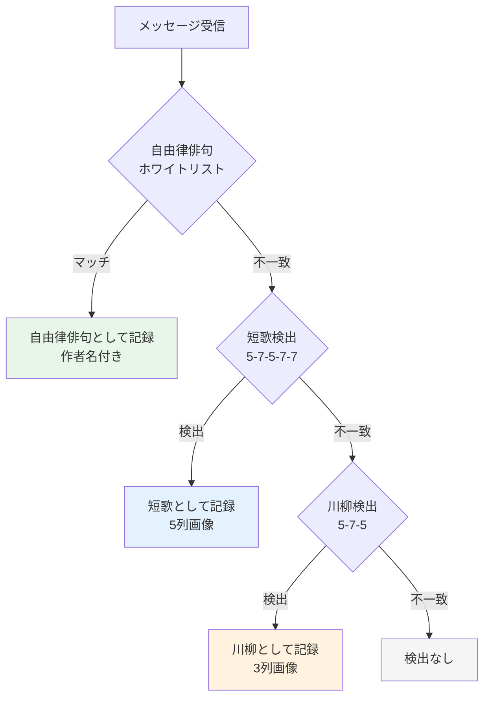

# FindSenryu4Discord アーキテクチャドキュメント

## システム全体構成



## パッケージ構成



## メッセージ検出フロー

ユーザーがメッセージを送信してから川柳が検出されるまでの全ステップ。



## 画像生成パイプライン



## 縦書きレイアウト

川柳(3列)、短歌(5列)、自由律俳句(1列)に対応。

```
川柳 (5-7-5)          短歌 (5-7-5-7-7)           自由律俳句
┌─────────────┐      ┌─────────────────┐      ┌─────────────┐
│    句 句 句 │      │  句 句 句 句 句 │      │             │
│    の の の │      │  の の の の の │      │    咳       │
│    上 中 下 │      │  五 四 下 中 上 │      │    を       │
│             │      │                 │      │    し       │
│             │      │                 │      │    て       │
│   作       │      │   作           │      │    も       │
│   者       │      │   者           │      │    一       │
│   名       │      │   名           │      │    人       │
│   [印]     │      │   [印]         │      │             │
└─────────────┘      └─────────────────┘      │   作       │
                                               │   者       │
列の流れ: 右 → 左                               │   名       │
文字の流れ: 上 → 下                              │   [印]     │
                                               └─────────────┘
```

## スラッシュコマンド処理フロー



## WebGUI フロー



## データモデル



## インフラ構成



## 検出優先順位


